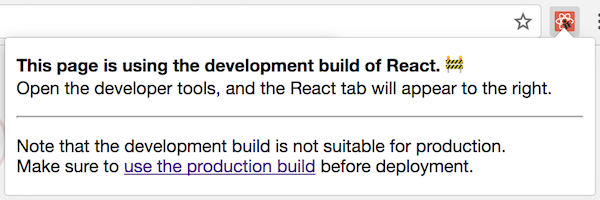

随着我们不断地在 [React 16](/blog/2017/09/26/react-v16.0.html) 的投入，我们在 React 仓库中对其目录结构和大量的构建工具进行了改版。此外，我们将类似 [Rollup](https://rollupjs.org/)， [Prettier](https://prettier.io/)，和 [Google Closure Compiler](https://developers.google.com/closure/compiler/) 引入到我们的工作流中。其他开发者通常会问我们在项目中如何使用这些工具等问题。在本篇博客中，我们将分享一些我们在 2017 年在构建工具和测试等基础架构上所做的一些改变，以及激励他们尝试的原因。

尽管这些改变帮助我们将 React 变得更好，但他们并不会直接影响大多数 React 用户。然而，我们希望能够在博客中将其记录下来以能够帮助到其他库的作者来解决类似问题。我们的贡献者可能也会发现这些记录非常有用。

## 通过 Prettier 格式化代码 {#formatting-code-with-prettier}

React 是第一个[完全拥抱](https://github.com/facebook/react/pull/9101)[Prettier](https://prettier.io/)的大型软件库之一，通过其来自动格式化代码。我们当前的 Prettier 配置组成：

* [使用 Prettier Node API 的](https://github.com/facebook/react/blob/cc52e06b490e0dc2482b345aa5d0d65fae931095/scripts/prettier/index.js#L71-L77)本地的 [`yarn prettier`](https://github.com/facebook/react/blob/cc52e06b490e0dc2482b345aa5d0d65fae931095/package.json#L115) 命令来格式化文件。我们一般在提交变更之前运行。其非常快，因为其仅检查[之前从远程服务器下发的变更文件](https://github.com/facebook/react/blob/cc52e06b490e0dc2482b345aa5d0d65fae931095/scripts/shared/listChangedFiles.js#L29-L33)。
* [运行 Prettier](https://github.com/facebook/react/blob/cc52e06b490e0dc2482b345aa5d0d65fae931095/scripts/prettier/index.js#L79-L90) 脚本是我们[持续集成检查](https://github.com/facebook/react/blob/d906de7f602df810c38aa622c83023228b047db6/scripts/circleci/test_entry_point.sh#L10)的一部分。其不会尝试重写文件，但其仍有可能构建失败若任何文件和 Prettier 输出的文件不同。这确保了除非其已经被完全格式化，否则我们无法合并提交请求。

一部分团队成员也已经将其设置为[编译器集成](https://prettier.io/docs/en/editors.html)。我们对 Prettier 的体验非常棒，我们也推荐给其他任何写 JavaScript 的团队。

## 重组成单一仓库 {#restructuring-the-monorepo}

自从 React 被分解成包，其已经成为了的[独立库（monorepo）](https://danluu.com/monorepo/)：一系列的包被放在一个单独的库下。这使得其更容易进行调整和共用工具，但我们的目录结构嵌套过深以致于难以理解。哪个文件归属于哪个包并不是很清晰。自 React 16 发布之后，我们决定完全重新调整仓库结构。这就是我们的成果。

### 迁移到 Yarn {#migrating-to-yarn-workspaces}

Yarn 包管理工具在几个月前[引入了一种称为工作间（Workspaces）的特性](https://yarnpkg.com/blog/2017/08/02/introducing-workspaces/)。这一特性能够让你告诉 Yarn 你的独立库的包在文件目录的什么位置。每一次你运行 `yarn`，除了安装你的依赖它还会设置从你项目的 `node_modules` 指向你的包的资源文件的符号链接（symlink）。

由于有工作间，我们自己的包之间的完全引入（例如从 `react-dom` 中引入 `react`）仅能够和任何支持 Node 解析机制的工具一起使用。我们遇到的唯一问题则是 Jest 没有在链接包内部进行转换，但我们[发现了修复办法](https://github.com/facebook/jest/pull/4761)，并将其合并到 Jest 中。

为支持 Yarn 工作间，我们增加了 `"workspaces": ["packages/*"]` 到我们的 [`package.json`](https://github.com/facebook/react/blob/cc52e06b490e0dc2482b345aa5d0d65fae931095/package.json#L4-L6) 中，并将所有的代码移入到[顶层的 `packages/*` 文件夹中](https://github.com/facebook/react/tree/cc52e06b490e0dc2482b345aa5d0d65fae931095/packages)，每个都有单独的 `package.json` 文件

每个包以相同的方式组织。对于每一个公开的 API 入口如 `react-dom` 或 `react-dom/server`，在包的根目录下有一个文件对来自 `/src/` 下的子目录重新暴露。将入口指向源代码而不是构建版本是有意而为之。通常，我们在开发期间会在每一次变更后重新运行部分测试。必须进行构建项目来运行测试会出奇的慢。当我们将包发布到 npm 时，我们再在 `/npm/` 文件夹下将入口文件指向构建版本。

并不是所有包都要发布到 npm 上。例如，我们保留一些很小的工具函数并可以安全地复制到一个[称为 `shared` 的伪包](https://github.com/facebook/react/tree/cc52e06b490e0dc2482b345aa5d0d65fae931095/packages/shared)。我们的打包器被配置成[仅会将声明在 `package.json` 的 `dependencies` 中的项目作为第三方库](https://github.com/facebook/react/blob/cc52e06b490e0dc2482b345aa5d0d65fae931095/scripts/rollup/build.js#L326-L329)，因此其可以很顺利地将 `shared` 的代码打包到 `react` 和 `react-dom` 中而不会在构建版本中留下任何对 `shared/` 的引用。因此你也可以使用 Yarn 工作间即使你不打算发布实际的 npm 包！

### 移除自定义模块系统 {#removing-the-custom-module-system}

过去，我们使用了一个称为 "Haste" 的非标准模块系统，其能够让我们通过唯一的 `@providesModule` 从其他文件引用在其他任何地方的任何文件。其完全避免了类似 `../../../../` 相对路径过深的引用问题并且对于生产代码来说很棒。然而，这使得在包之间很难理解其依赖关系。我们也不得不重新调整这一黑科技使其能和不同的工具一同运行。

我们决定 [移除 Haste](https://github.com/facebook/react/pull/11303) 并使用 Node 的相对引用的解析机制来代替。为避免相对路径过深的问题，我们将[我们的仓库结构进行扁平化处理](https://github.com/facebook/react/pull/11304) 所以在每个包内部之多有一层深度：

```
|-react
|  |-npm
|  |-src
|-react-dom
|  |-npm
|  |-src
|  |  |-client
|  |  |-events
|  |  |-server
|  |  |-shared
```

这样，其相对路径只会包含一个 `./` 或 `../`，后跟文件名。若一个包需要引入另外一个，其可以通过绝对路径从顶层入口来引入。

实践中，我们仍然会有[一些跨包间的“内部”引入](https://github.com/facebook/react/blob/cc52e06b490e0dc2482b345aa5d0d65fae931095/packages/react-dom/src/client/ReactDOMFiberComponent.js#L10-L11)。其打破了这一原则，但很明确，我们计划逐渐摆脱这一方式。

## 编译成扁平化的包 {#compiling-flat-bundles}

历史上，React 被分成两种不同的形式：作为一个单文件构建版本以让你能够在浏览器中通过一个 `<script>` 标签引用，和作为 CommonJS 模块的集合以让你能够通过类似 webpack 或 Browserify 来进行打包。

React 16 之前，作为 npm 包发布的组成部分的每个 React 源文件对应着一个 CommonJS 模块。导入 `react` 或 `react-dom` 使得打包器从它们通过 CommonJS 模块在[内部的 `lib` 文件夹](https://unpkg.com/react@15/lib/)构建的依赖树作为[入口](https://unpkg.com/react@15/lib/)。

然而，这一方式有诸多缺点：

* **不一致** 不同的工具对于引入相同的 React 代码会产生不同的尺寸，相差最多会达到 30 kB（gzip 之前）。
* **对于打包器用户来说非常低效** 现今大多数打包器会在模块边界产生大量的 “胶水代码”。其让模块间能够相互独立，但增加了解析时间，包的尺寸以及构建时间。
* **对于 Node 用户来说非常低效** 当在 Node 环境下运行时，在针对开发模式的代码执行前运行 `process.env.NODE_ENV` 会由于其检查环境变量而带来二娃的开销。这拖慢了 React 服务端渲染。我们也无法缓存到一个变量内，因为其妨碍了 Uglify 进行无用代码的擦除。
* **破坏了封装** React 内部文件同时被暴露在开源社区（通过 `react-dom/lib/*` 引入）和 Facebook 内部。首先其是一种非常方便在项目内共享工具函数的方式，但同时这也增加了维护成本，因为重命名或改变内部函数的参数类型都可能会破坏不相关的项目。
* **妨碍新特性实验** 对于 React 团队来说没有其他方式来实验任何新的编译技术。例如，理论上，我们可能会想要应用[新的 Google Closure Compiler](https://developers.google.com/closure/compiler/docs/api-tutorial3) 压缩或 [Prepack](https://prepack.io/) 来处理我们的部分代码，但他们被设计成是针对完整的包而不是我们曾经发布到 npm 的小的独立模块。

由于这样那样的问题，我们在 React 16 调整了策略。对于 Node.js 和打包器我们仍发布到 CommonJS 模块，每一个入口我们仅发布两个 CommonJS 包而不是在 npm 包中发布许多独立的文件

例如，当你在 React 16 引入 `react` 时，打包器会发现[入口](https://unpkg.com/react@16/index.js)，只需要重新导出两个文件中的一个：

```js
'use strict';

if (process.env.NODE_ENV === 'production') {
  module.exports = require('./cjs/react.production.min.js');
} else {
  module.exports = require('./cjs/react.development.js');
}
```

在 React 提供的每个包里， [`cjs` 文件夹](https://unpkg.com/react@16/cjs/) ("CommonJS" 的简写) 下面包含了为每个入口起点提供的开发版本和预发布版本的 bundle。

比如说，[`react.development.js`](https://unpkg.com/react@16/cjs/react.development.js) 是供开发版使用的。它具有较强的可读性并且有一些注释。另一方面，[`react.production.min.js`](https://unpkg.com/react@16/cjs/react.production.min.js) 在被发布到 npm 之前是经过压缩优化的。

注意这和我们之前使用的单文件的浏览器构建策略实质上是非常相似的（现在仅是重新规划到 [`umd` 目录](https://unpkg.com/react@16/umd/)下，[通用模块定义（Universal Module Definition）](https://www.davidbcalhoun.com/2014/what-is-amd-commonjs-and-umd/)的缩写）。现在我们也对 CommonJS 构建采用同样的策略。

### 迁移至 Rollup {#migrating-to-rollup}

仅仅是将 CommonJS 模块编译成单文件包并不能解决之前的所有问题。而真正标志性的胜利是将我们的打包系统从 Browserify 到 [Rollup](https://rollupjs.org/)[迁移](https://github.com/facebook/react/pull/9327)。

[Rollup 本质上被设计成针对库而不是应用](https://medium.com/webpack/webpack-and-rollup-the-same-but-different-a41ad427058c)，其非常适合 React 这样的用例。它非常好的解决了一个问题：如何将多个模块的代码通过非常小的垃圾代码整合到一个扁平化文件中。为了达到这一要求，其将所有的代码放到同一作用域下并重命名变量以保证他们不会冲突，而非像其他打包器一样将模块变成函数。这样产生的代码更易于 JavaScript 引擎解析，易于阅读，也易于压缩器优化。

Rollup 目前还不支持一些对于应用构建来说非常重要的特性，例如代码分隔。然而，其并不算致力于替换掉诸如非常擅长处理这类工作的 webpack。Rollup 非常适合如 React 等 *框架*，因为其能够被预构建而后被集成到应用中。

你可以在[这里](https://github.com/facebook/react/blob/8ec146c38ee4f4c84b6ecf59f52de3371224e8bd/scripts/rollup/build.js#L336-L362)找到我们的 Rollup 构建配置，和[当前我们在用的一系列插件](https://github.com/facebook/react/blob/8ec146c38ee4f4c84b6ecf59f52de3371224e8bd/scripts/rollup/build.js#L196-L273)。

### 迁移至 Google Closure Compiler {#migrating-to-google-closure-compiler}

在迁移至扁平化包之后，我们开始在 [JavaScript 版本的 Google Closure Compiler](https://github.com/google/closure-compiler-js) 下使用它的“简单”模式。根据我们的经验，即使先进的压缩技术不可用，其仍然能够明显优于 Uglify，由于其能够更好的消除无用代码和在适当的时候内联函数。

首先，我们可以对我们发布到开源社区仅使用 Google Closure Compiler。在 Facebook，我们仍然需要检查包来解压，以让我们能够在 React 生产环境崩溃时候能够通过我们的错误报告工具进行定位（symbolicate）。我们通过设置了一个完全禁止编译器重命名的[标志](https://github.com/google/closure-compiler/pull/2707)来完成开发。这使得我们应用其他如函数内联（function inlining），但为 Facebook 特定的 React 构建版本保留了完整的代码可读性。为了提高输出的可读性，我们[也使用 Prettier 来自定义构建](https://github.com/facebook/react/blob/cc52e06b490e0dc2482b345aa5d0d65fae931095/scripts/rollup/build.js#L249-L250)。有趣的是，在调试构建的过程时运行生产版本的构建包是在构建包里发现无用代码的一种很好的方式。

当前，所有 React 的产品包 [通过在 Google Closure Compiler 简单模式下运行](https://github.com/facebook/react/blob/cc52e06b490e0dc2482b345aa5d0d65fae931095/scripts/rollup/build.js#L235-L248)，同时我们也期望能够在未来支持更先进的优化方案。

### 防止若无用代码被擦除 {#protecting-against-weak-dead-code-elimination}

当我们在 React 上使用一个有效的[无用代码擦除](https://en.wikipedia.org/wiki/Dead_code_elimination)方案时，我们无法对 React 用户使用的工具做许多的假设。

通常，当你[在为生产环境配置一个打包器](/docs/optimizing-performance.html#use-the-production-build)时，你需要告诉它通过 `"production"`字符串替换掉 `process.env.NODE_ENV`。这一环节有时候被称为“环境检查（envification）”。思考这一代码：

```js
if (process.env.NODE_ENV !== "production") {
  // development-only code
}
```

在环境检查后，这一判断条件将会永远为 `false`，并会被大多数压缩器完全擦除：

```js
if ("production" !== "production") {
  // development-only code
}
```

然而，若打包器被误配置，你可能意外地将开发版本的代码发布到生产环境中。我们无法阻止这一问题，但当发生时，我们可以设置一些步骤减少一些常见的用例。

#### 防止过晚环境检查 {#protecting-against-late-envification}

如之前提到，我们的入口现在看起来像这样：

```js
'use strict';

if (process.env.NODE_ENV === 'production') {
  module.exports = require('./cjs/react.production.min.js');
} else {
  module.exports = require('./cjs/react.development.js');
}
```

然而，一些打包器会在环境检查之前执行 `require`。在这样的情况，即使 `else` 无法执行，文件 `cjs/react.development.js` 仍然会被打包。

为了防止这一情况，我们也将整个开发版本的 `cjs/react.development.js`  包内容包裹在另外一个 `process.env.NODE_ENV` 检查：

```js
'use strict';

if (process.env.NODE_ENV !== "production") {
  (function() {
    // bundle code
  })();
}
```

这一方式，即使应用打包了开发版本和生产版本的文件，开发版本的文件在环境检查后将会是空。

额外的 [IIFE](https://en.wikipedia.org/wiki/Immediately-invoked_function_expression) 包裹是有必要的，因为在 JavaScript 中 `if` 语句内部的一些声明（如函数）无法被替换。

#### 检测错误的无用代码擦除 {#detecting-misconfigured-dead-code-elimination}

即使[环境变更](https://twitter.com/iamakulov/status/941336777188696066)，许多流行的打包器目前仍无法强制用户指定是开发模式或生产模式。在这样的情况，`process.env.NODE_ENV` 通常由运行时的 polyfill 设置，但无用代码擦除检测并不会有效。

我们无法完全阻止 React 用户错误配置他们的打包器，但我们可以在 [React DevTools](https://github.com/facebook/react-devtools) 里引入一些额外的检查。

若执行的是开发包，[React DOM 会报告给 React 开发工具](https://github.com/facebook/react/blob/d906de7f602df810c38aa622c83023228b047db6/packages/react-dom/src/client/ReactDOM.js#L1333-L1335)：

<br>



仍然有一些更糟糕的场景。有时，`process.env.NODE_ENV` 在运行时被设置为 `"production"` 而不是在构建时间。这在 Node.js 是正常的，但对于客户端构建来说则很糟糕，因为无用的开发代码也被打包进去了，即使其永远不会执行。这更难被检测到，但我们发现了在大多数情况下效果不错的一个试探性方法并且貌似不会产生误差。

我们可以写一个函数，仅在[开发分支](https://github.com/facebook/react/blob/d906de7f602df810c38aa622c83023228b047db6/packages/react-dom/npm/index.js#L11-L20)下包含任意字符串。而后，若 `process.env.NODE_ENV` 被设置为 `"production"`，我们可以在[那个函数里调用 `toString()`](https://github.com/facebook/react-devtools/blob/b370497ba6e873c63479408f11d784095523a630/backend/installGlobalHook.js#L143)并去验证仅会在开发模式下才会被抛出的字符串。若仍然在这里，无用代码的擦除并不会生效，而且我们也需要警告开发者。由于开发可能不会注意到 React DevTool 在生产页面发出的警告。 我们也在 React DevTool 从 [`setTimeout` 扔出一个错误](https://github.com/facebook/react-devtools/blob/b370497ba6e873c63479408f11d784095523a630/backend/installGlobalHook.js#L143)并希望能够被错误分析工具捕获。

我们意识到这方法有些脆弱。`toString()` 方法并不可靠并且可能在未来有些浏览器上会改变它的行为。这就是为什么我们将这些逻辑放到 React DevTool 里而不是 React 里。如果在之后出现了问题，这允许我们能移除它。我们也会发出警告仅当我们*发现*特别的字符串而不是我们*没*发现它。这一方式，如果 `toString()` 的输出变得不可测，或被重写，这一警告也不会触发。

## 尽早捕获错误 {#catching-mistakes-early}

我们想要尽早地捕获错误。然而，即使扩展我们的测试覆盖率，我们偶尔还是会犯错误。今年我们在我们的构建和测试环节做了些调整以使其更难出错。

### 迁移至 ES 模块 {#migrating-to-es-modules}

通过 CommonsJS 的 `require()` 和 `module.exports`，其很容易引入一个实际上并不存在的函数，且直到你调用才会意识到。然而，若你输入错了一个引入的方法名称，类似 Rollup 这样原生支持 [`import`](https://developer.mozilla.org/en-US/docs/Web/JavaScript/Reference/Statements/import) 和 [`export`](https://developer.mozilla.org/en-US/docs/web/javascript/reference/statements/export) 语法的工具将会构建失败。在 React 16 发布后，我们将整个 React 的源码调整成为了 ES 模块语法。

不仅提供了额外的保护，也缩小了构建包的体积。许多 React 模块仅暴露工具函数，但 CommonJS 强制要求我们将它们包装到对象里。通过将这些工具函数转换成命名的暴露并消除包装它们的对象，我们让 Rollup 将其放置在顶层作用于，这样能够让压缩器在生产版本压缩它们的名称。

目前，仅决定将源代码转换成 ES 模块，但不包括测试代码。我们使用类似 `jest.resetModules()` 这样强有力的工具并想要在测试中当模块初始化时能有更紧密的控制力。为了在测试中使用 ES 模块，我们支持了 [Babel CommonJS transform](https://github.com/facebook/react/blob/cc52e06b490e0dc2482b345aa5d0d65fae931095/scripts/jest/preprocessor.js#L28-L29) 插件，但仅针对测试环境。

### 在生产模式下运行测试 {#running-tests-in-production-mode}

过去，我们在开发环境下运行所有测试。这让我们对 React 所产生的警告信息进行测试，并且貌似有一种普通的意义。然而，即使我们尝试在开发环境和生产环境上保持代码路径最小化的差异，但我们仍然会意外地在仅针对生产环境的代码上出现未被测试覆盖的错误，并且会产生一个 issues 在 Facebook 的 React 仓库上。x

为了解决这一问题，我们在CI（持续集成）上增减了运行所有 pull request 的 [`yarn test-prod`](https://github.com/facebook/react/blob/cc52e06b490e0dc2482b345aa5d0d65fae931095/package.json#L110) 的新命令，[在生产环境下执行所有的测试用例](https://github.com/facebook/react/pull/11616)。我们将所有测试里任何有关警告信息的测试断言都包裹在开发模式的条件分支下，因此在两种环境下，他们仍然可以检测其预期行为。由于我们自定义了一个 通过[错误代码](/blog/2016/07/11/introducing-reacts-error-code-system.html)来替换生产环境的错误信息的 Babel 转换插件，我们也加入了一个[逆向转换](https://github.com/facebook/react/blob/cc52e06b490e0dc2482b345aa5d0d65fae931095/scripts/jest/setupTests.js#L91-L126)作为生产环境测试运行的一部分。

### 在测试环境下使用公共 API  {#using-public-api-in-tests}

当我们[重写 React reconciler](https://code.facebook.com/posts/1716776591680069/react-16-a-look-inside-an-api-compatible-rewrite-of-our-frontend-ui-library/)，我们意识到了对公共 API 而不是针对对内部模块编写测试的重要性。若针对公共 API 编写测试，其从用户视角来看什么需要被测试是非常清晰的，即使你完全从零开始重新实现，你也可以运行它。

我们到非常棒的 React 社区[寻求帮助](https://github.com/facebook/react/issues/11299)将剩余的测试调整为测试公共 API。目前大部分的测试都已经被调整了。这一过程并不容易。有时一个单元测试仅调用一个内部方法，并且从用户地角度来看很难明确指出其期望测试的行为。我们找寻出了一些策略来解决这一问题。第一件事就是尝试从 git 的历史记录中找出该测试被添加的时间点，并从 issue 和 提交（pull request）的描述中发现一些线索。通常比原有的测试文件更有价值！一个很好验证猜测的方式是注释掉被测试的代码中某一行。若测试失败，我们便可以确定其在特定代码路径的重要性。

我们想要给[每一位贡献过的伙伴](https://github.com/facebook/react/issues?q=is%3Apr+11299+is%3Aclosed)献上我们深深地感谢。

### 对编译后的包运行测试 {#running-tests-on-compiled-bundles}

这也是对公共 API 编写测试的额外收益：现在我们可以[对编译后的包运行测试](https://github.com/facebook/react/pull/11633)。

这帮助我们确保类似 Babel、Rollup 和 Google Closure Compiler 不会引人任何的 bug。这也为之后更为激进的优化方式打开了一扇门，只要我们能够确保 React 被优化之后能和之前预期的行为保持一致。

为了实现这一效果，我们创建了[第二个 Jest 配置](https://github.com/facebook/react/blob/cc52e06b490e0dc2482b345aa5d0d65fae931095/scripts/jest/config.build.js)。它重写我们默认的配置，把入口指向了 `react`、`react-dom`，并将其他入口指向 `/build/packages/` 文件夹。该文件夹并不包含任何 React 的源码，并反应了发布到 npm 上的内容。其在你运行 `yarn build` 之后生成。

这使得我们能够像我们通常在源代码运行的测试一样进行精准的测试，但使用开发环境和通过 Rollup 和 Google Closure Compiler 构建的生产环境的预发布的 React 包来执行。

不同于普通的测试，包测试依赖于构建产品，因此其无法很好的快速迭代。然而，其仍然能够通过在 CI 服务上运行，因此若出现崩溃，测试将会显示测试失败，我们也将会知道无法安全地将其合并到 master 分支上。

仍有一些测试文件我们故意没有在编译包上运行。有时我们想要模拟（mock）一个内部模块或重写一个目前不希望公开的特性标记。对于这些情况，我们通过将文件名从 `MyModule-test.js` 重命名为 `MyModule-test.internal.js` 来将其列入测试文件的黑名单。

目前，在 2,650 个 React 测试中有超过 93% 的测试是针对编译后的包。

### 格式化编译后的包  {#linting-compiled-bundles}

除了格式化我们的源代码，我们在编译后的包上运行了更多一系列的格式化规则检查（实际上，[仅有两个](https://github.com/facebook/react/blob/cc52e06b490e0dc2482b345aa5d0d65fae931095/scripts/rollup/validate/eslintrc.cjs.js#L26-L27)）。这在底层工具上给了我们额外的保护防止引入异常并[确保](https://github.com/facebook/react/blob/cc52e06b490e0dc2482b345aa5d0d65fae931095/scripts/rollup/validate/eslintrc.cjs.js#L22)包没有使用更老的浏览器不支持的任何语言特性。

### 模拟包发布 {#simulating-package-publishing}

甚至在构建后的包上运行测试也无法避免引入破坏的更新。例如，我们在我们的 `package.json` 文件中使用 `files` 字段来指向应该被发布到 npm 上的关于具体的文件夹和文件的白名单。然而，其很容易增加一个新的入口指向一个包但是忘记将其添加到白名单内。甚至包的测试已经通过，但在发布之后其入口则会丢失。

为了避免类似的情况，现在，在构建之后我们[通过运行 `npm pack` 和 快速解压](https://github.com/facebook/react/blob/cc52e06b490e0dc2482b345aa5d0d65fae931095/scripts/rollup/packaging.js#L129-L134)来模拟 npm 发布。类似 `npm publish`，这一命令过滤了任何不在 `files` 白名单内的任何东西。通过这一方式，若我们忘记添加一个入口到列表中，其将会在构建文件夹中缺失，而依赖于它的包测试将会失败。

### 创建手动测试文件 {#creating-manual-test-fixtures}

我们的单元测试仅在 Node 环境下运行，但不在浏览器环境下。这是有意而为之，因为在我们的经验中基于浏览器的测试工具非常奇怪，并且无法捕获许多问题。

我们可以摆脱这一问题，因为访问 DOM 的代码是固定的在少数几个文件中，并且通常不会改变。每周，我们将 Facebook.com 的 master 分支代码更新到 React 的最新提交。在 Facebook，对于重要的产品流程，我们使用了一系列内部的 [WebDriver](http://www.seleniumhq.org/projects/webdriver/) 测试，并能够捕获一些异常。React 更新首先会被员工使用，因此紧急的 bug 会在它们到达 200 万的用户前被报告。

其仍然很难评审 DOM 相关的变更，而且我们偶尔也会犯错误。尤其是，很难记住所有代码必须要处理的边界条件，为什么要被添加，以及何时能将它们安全地移除。我们考虑增加些在浏览器上运行的自动化测试，但我们不想拖慢整个开发周期并处理一个脆弱的 CI 环境。自动化测试并不是永远都能捕获 DOM 异常。例如，一个显示在浏览器上的输入值可能和它所报告的 DOM 属性不匹配。

我们就这个问题和 [Brandon Dail](https://github.com/aweary)、 [Jason Quense](https://github.com/jquense) 以及 [Nathan Hunzaker](https://github.com/nhunzaker) 进行了交谈。他们之前为 ReactDOM 提交了大量的补丁但很遗憾的是我们没有及时地进行审阅。我们决定给他们提交的权限，但要求他们对于类似输入管理的 DOM 相关的区域创建[一系列的手工测试](https://github.com/facebook/react/pull/8589)。这一整套手动的测试文件在过去一年[不断增长](https://github.com/facebook/react/commits/master/fixtures/dom)。

这些测试文件作为 React 应用的设施放在 [`fixtures/dom`](https://github.com/facebook/react/tree/d906de7f602df810c38aa622c83023228b047db6/fixtures/dom) 里。增加一个测试文件涉及编写一个代码有预期行为说明的 React 组件和相关问题及浏览器怪异行为（quirks）的链接，类似[这个例子](https://github.com/facebook/react/pull/11760)：


这个测试文件应用能够让你选择一个方便对比改变前后的 React 版本（本地或已发布到 npm 的版本）。当我们改变 DOM 交互的相关行为时，我们能够通过在不同的浏览器运行相关的测试文件验证其是否还存在问题。

在某些情况，一个改变复杂到需要一个单独的并基于此专门构建的测试文件来进行验证。例如，[在 React 16 中处理 DOM 属性](/blog/2017/09/08/dom-attributes-in-react-16.html)很难在一开始就能自信地实现。我们尝试挖掘不同滴边界条件，并为 React 16 的及时发布几乎放弃了它。然而，我们构建了一份 用于在之前 React 版本和下一版本 React 渲染所有支持的属性和错误拼写的属性的["属性表测试文件（attribute table fixture）"](https://github.com/facebook/react/tree/d906de7f602df810c38aa622c83023228b047db6/fixtures/attribute-behavior) ，并显示两者的不同。其耗费了一些循环（关键的特性是将相似的行为组合到一起）但其最终能够让我们在几天时间内修复所有主要的问题。

<br>

<blockquote class="twitter-tweet"><p lang="en" dir="ltr">We went through the table to vet the new behavior for every case (and discovered some old bugs too) <a href="https://t.co/cmF2qnK9Q9">pic.twitter.com/cmF2qnK9Q9</a></p>&mdash; Dan Abramov (@dan_abramov) <a href="https://twitter.com/dan_abramov/status/906244378066345984?ref_src=twsrc%5Etfw">September 8, 2017</a></blockquote> <script async src="https://platform.twitter.com/widgets.js" charset="utf-8"></script>

运行测试文件仍然有大量的工作，我们考虑将其中一部分自动化。测试应用仍然是非常宝贵的，甚至是对 React 目前存在的行为和所有的边界条件以及浏览器 bug 的一个文档。使我们有信心在不破坏重要的用例的条件下对逻辑进行重大的调整。我们考虑的另外一个调整是增加一个 Github 机器人构建 并对每一次涉及相关文件的提交自动地部署测试文件，因此每个人都可以进行浏览器测试。

### 预防死循环 {#preventing-infinite-loops}

React 16 代码包含了大量的 `while` 循环。它们让我们避免发生在早期 React 版本的可怕的过深的调用栈路径，但使得 React 开发变得非常难。每次退出条件出现错误时我们的测试将会被挂起，并花费一些时间来找出哪个循环引发了这一问题。

受到 [Repl.it 所采用策略的](https://repl.it/site/blog/infinite-loops) 启发，我们在测试环境增加了一个[防止死循环的 Babel 插件](https://github.com/facebook/react/blob/d906de7f602df810c38aa622c83023228b047db6/scripts/babel/transform-prevent-infinite-loops.js)。若某些循环超过了循环允许的最大数值，我们将会抛出一个错误并立刻失效以让 Jest 能够准确地显示确切的发生位置。

这一方式有一个缺陷。若一个错误从 Babel 插件中产生并忽略函数调用栈，测试将会通过即使是死循环。这真的、真的非常糟糕。为解决这一问题，我们在抛出错误之前[设置了一个全局区域](https://github.com/facebook/react/blob/d906de7f602df810c38aa622c83023228b047db6/scripts/jest/setupTests.js#L42-L56)。而后，在每次测试运行之后，如果全局区域已经被设置了我们将重新爆出错误。这一方式下任何死循环将会造成测试失败，无论错误是否是由 Babel 插件引起。

## 自定义构建 {#customizing-the-build}

在引入新的构建流程后，仍然有一些东西我们必须进行微调。其花费了我们一些时间来处理，但我们对于我们所能找到的解决方案表示满意。

### 消除无用代码 {#dead-code-elimination}

Rollup 和 Google Closure Compiler 的结合已经能够让我们在生产包中仅将开发的代码剥离。我们在构建期间将 `__DEV__` 字符串[替换](https://github.com/facebook/react/blob/cc52e06b490e0dc2482b345aa5d0d65fae931095/scripts/rollup/build.js#L223-L226)为一个布尔类型的常量，Rollup 和 Google Closure Compiler 都能够将 `if (false) {}` 的代码分支以及一些更复杂的模式给移除。然而，仍然存在一个非常讨厌的情况：

```js
import warning from 'fbjs/lib/warning';

if (__DEV__) {
  warning(false, 'Blimey!');
}
```

这一模式在 React 源码中非常常见。然而 `fbjs/lib/warning` 是一个外部引入的库，而不是 Rollup 打包的 CommonJS 包。因此，即使 `warning()` 完全被移除，Rollup 仍然不知道能否安全地移除整个引入。要是模块在初始化期间有副作用？那移除操作将会变得不安全。

为解决这一问题，我们使用了 [Rollup 的 `treeshake.pureExternalModules` 选项](https://github.com/facebook/react/blob/cc52e06b490e0dc2482b345aa5d0d65fae931095/scripts/rollup/build.js#L338-L340)，将确保不会产生副作用的模块保存在一个数组里。这能够让 Rollup 知道如果 `fbjs/lib/warning` 引入未被使用，能够完全安全地将它从代码中剥离。然而， 如果它*正在*被使用（例如我们决定在生产版本中增加警告），import 则将会被保留。这就是为什么这一方式比替换成空模块更为安全。

当我们进行某些优化，我们需要确保其不会在之后引入 bug。要是某人引入了一个新的仅在开发模式下可用的额外的库，并且未意识也到需要添加到 `pureExternalModules` 里？Rollup 在这样的情况会打印出一个警告，但我们[决定让整个构建环节都失效](https://github.com/facebook/react/blob/cc52e06b490e0dc2482b345aa5d0d65fae931095/scripts/rollup/build.js#L395-L412)。这强制人们每次增加一个仅在开发模式下可用的包就需要直接地声明[而无论其是否具有副作用](https://github.com/facebook/react/blob/cc52e06b490e0dc2482b345aa5d0d65fae931095/scripts/rollup/modules.js#L10-L22) 。

### Fork 模块 {#forking-modules}

在某些情况，不同的包需要包含些稍微不同的代码。例如，React Native 有不同的错误处理机制，即展示一个红框而不是打印一条信息到控制台。然而，通过模块调用将差异串联起来非常地不方便。

类似这样的问题通常通过运行时配置进行解决。然而，有时候则无法处理：例如，React DOM 包甚至不应该去引入 React Native 的 redbox 函数。将从未在指定环境运行下使用的代码进行打包也是非常糟糕的。

另一种方式是使用动态依赖注入。然而，这通常会使得代码难以理解并可能造成严重的依赖。这也使得一些优化的机会落空。

从代码的角度来看，理想情况下我们仅希望将不同的模块重新指向特定的包。这一 “fork” 和原来的模块一样有相同的 API，但处理的方式不同。我们发现这一模型非常直观，并[创建了一个 fork 配置文件](https://github.com/facebook/react/blob/cc52e06b490e0dc2482b345aa5d0d65fae931095/scripts/rollup/forks.js) 来对如何与他们原始的模块进行映射以及在哪些条件下会发生进行详细说明。

例如，fork 配置入口对于不同的包指定了不同的 [特性标志](https://github.com/facebook/react/blob/cc52e06b490e0dc2482b345aa5d0d65fae931095/packages/shared/ReactFeatureFlags.js)：

```js
'shared/ReactFeatureFlags': (bundleType, entry) => {
  switch (entry) {
    case 'react-native-renderer':
      return 'shared/forks/ReactFeatureFlags.native.js';
    case 'react-cs-renderer':
      return 'shared/forks/ReactFeatureFlags.native-cs.js';
    default:
      switch (bundleType) {
        case FB_DEV:
        case FB_PROD:
          return 'shared/forks/ReactFeatureFlags.www.js';
      }
  }
  return null;
},
```

在构建期间，若条件满足，[我们自定义的 Rollup 插件](https://github.com/facebook/react/blob/cc52e06b490e0dc2482b345aa5d0d65fae931095/scripts/rollup/plugins/use-forks-plugin.js#L40)将会用它们 fork 的模块来替换。由于原始模块和 fork 的模块都由 ES 模块写成， Rollup 和 Google Closure Compiler 可以内嵌（inline）类似数字或布尔值等常量，并因此对于不支持的特性标志能够有效地移除。在测试中，当需要时，我们[使用 `jest.mock()`](https://github.com/facebook/react/blob/cc52e06b490e0dc2482b345aa5d0d65fae931095/packages/react-cs-renderer/src/__tests__/ReactNativeCS-test.internal.js#L15-L17) 指向指向特定的 fork 版本。

作为回报，我们可能想要验证原始模块的导出类型和 fork 模块的导出类型是否完全匹配。我们可以使用一个[有些奇怪但完全能够正常运转的 Flow 技巧](https://github.com/facebook/react/blob/cc52e06b490e0dc2482b345aa5d0d65fae931095/packages/shared/forks/ReactFeatureFlags.native.js#L32-L36)来实现：

```js
import typeof * as FeatureFlagsType from 'shared/ReactFeatureFlags';
import typeof * as FeatureFlagsShimType from './ReactFeatureFlags.native';
type Check<_X, Y: _X, X: Y = _X> = null;
(null: Check<FeatureFlagsShimType, FeatureFlagsType>);
```

这一方式通过强制 Flow 去验证两个模块是否能互相赋值（因此是相等的）。现在，如果我们在不改变其他文件的情况下修改原始模块或 fork 模块的导出，类型检查将会失败。这可能有点愚蠢，但我们发现在实践中非常有帮助。

概括一下这一章，注意如果你在 npm 上来使用 React 则无法指定你自己的 fork 模块。这是有意的，因为这些文件中没有公开的 API，而且它们并没有被 [semver](https://semver.org/) 所覆盖。然而，如果你不介意不稳定性和差异性风险，我们欢迎你从 master 分支上来构建 React 甚至是 fork 它。我们希望这篇文章对于记录从单个 JavaScript 库角度出发定位于不同的环境能提供帮助。

### 追踪包尺寸 {#tracking-bundle-size}

作为构建的最后一步，我们现在[记录所有构建包的构建大小](https://github.com/facebook/react/blob/d906de7f602df810c38aa622c83023228b047db6/scripts/rollup/build.js#L264-L272)并将它们写入到一个[类似这样](https://github.com/facebook/react/blob/d906de7f602df810c38aa622c83023228b047db6/scripts/rollup/results.json)的文件里。当运行 `yarn build`，其会打印一个结果的表格：

<br>


*（其并不是一直都这样好。这次提交是将 React 从 Uglify 迁移到 Google Closure Compiler。）*

记录文件大小对于每个人追踪包尺寸变化和激励着去发现优化的机会都十分有帮助。

我们对这一策略并不完全满意，因为 JSON 文件通常会在更大的分支中造成合并冲突。当前并不是强制进行更新，因此其可能会过时。之后，我们考虑将其集成到自动化中，在每次的提交中都会带有文件大小的变化。

## 简化发布换件 {#simplifying-the-release-process}

我们经常喜欢向开源社区发布更新。不幸的是，旧的流程在处理发布时非常的慢且通常会耗费一整天。在对这一流程做了些改变后，我们现在能够在一个小时内完成整个发布。这就是我们所做的调整。

### 分支策略 {#branching-strategy}

由于我们的分支策略，在旧的发布流程中消耗了大多数的时间。`master` 分支被认为不可靠的且通常会包含一些破坏性的更新。发布通常从一个稳定分支完成，且更新需要在发布前手动低将其挑选到这一分支中去。我们有[工具来帮助自动化](https://github.com/facebook/react/pull/7330)其中一些流程，但使用仍然[相当复杂](https://github.com/facebook/react/blob/b5a2a1349d6e804d534f673612357c0be7e1d701/scripts/release-manager/Readme.md)。

随 16 版本，我们现在从 `master` 分支上进行发布。实验特性和一些破坏性更新也被允许，但必须隐藏在[特性标记](https://github.com/facebook/react/blob/cc52e06b490e0dc2482b345aa5d0d65fae931095/packages/shared/ReactFeatureFlags.js)之后，所以他们能够在构建环节被移除。新的扁平化包和无用代码擦除使得我们不用担心将任何不想公开的代码泄露到开源版本中。

### 自动化脚本 {#automated-scripts}

将变更迁入到稳定的 `master` 后，我们创建了一个新的 [发布流程清单](https://github.com/facebook/react/issues/10620)。尽管比之前的环节更简单，这仍然包含了大量的步骤且遗忘了一个可能会导致一次异常的发布。

为解决这一问题，我们创建了一个新的 [自动地发布流程](https://github.com/facebook/react/pull/11223)，其[更容易使用](https://github.com/facebook/react/tree/master/scripts/release#react-release-script)并包含了几项构建检查以确保我们发布了一次有效的构建。新的流程被分隔为两步：_构建_ 和 _发布_。这是你第一次运行的样子：


_构建_ 环节做了大量的工作 - 验证许可，运行测试和检查 CI 状态。一旦其完成，其将会输出一个梯形清单到 CHANGELOG 并使用之前提到的 [手工装置](#creating-manual-test-fixtures) 来进行包验证。


剩下的就是进行标记（tag）并使用_发布_脚本发布到 NPM 上。


（你可能在之前的截图中注意到了 `--dry` 标记。该标记允许我们运行一次端到端的发布，而不会实际发布到 NPM。这对于处理发布脚本自身时非常有用。）

## 总结 {#in-conclusion}

这篇博客是否激励你让你在你自己的项目中尝试一些想法？我们确实希望如此。若你有其他关于如何构建 React，测试，或贡献工作流的提升，请在[我们的问题追踪器]上让我们知道(https://github.com/facebook/react/issues)。

你可以通过[构建基础设施标签](https://github.com/facebook/react/labels/Component%3A%20Build%20Infrastructure) 找到相关问题。这些通常是第一次贡献的好机会！

## 感谢 {#acknowledgements}

我们想要感谢：

* [Rich Harris](https://github.com/Rich-Harris) 和 [Lukas Taegert](https://github.com/lukastaegert) 对于 Rollup 的为何以及帮助我们迁移到那。
* [Dimitris Vardoulakis](https://github.com/dimvar)， [Chad Killingsworth](https://github.com/ChadKillingsworth) 和 [Tyler Breisacher](https://github.com/MatrixFrog) 对于他们在 Google Closure Compilre 上的工作以及及时的建议。
* [Adrian Carolli](https://github.com/watadarkstar)，[Adams Au](https://github.com/rivenhk)，[Alex Cordeiro](https://github.com/accordeiro), [Jordan Tepper](https://github.com/HeroProtagonist)，[Johnson](https://github.com/sjy)，[Soo Jae Hwang](https://github.com/misoguy)，[Joe Lim](https://github.com/xjlim)，[Yu Tian](https://github.com/yu-tian113) 和其他人帮助在原型和实现中所做的相关的改进。
* [Anushree Subramani](https://github.com/anushreesubramani)，[Abid Uzair](https://github.com/abiduzz420)，[Sotiris Kiritsis](https://github.com/skiritsis)，[Tim Jacobi](https://github.com/timjacobi), [Anton Arboleda](https://github.com/aarboleda1)，[Jeremias Menichelli](https://github.com/jeremenichelli)，[Audy Tanudjaja](https://github.com/audyodi)，[Gordon Dent](https://github.com/gordyd), [Iacami Gevaerd
](https://github.com/enapupe)，[Lucas Lentz](https://github.com/sadpandabear), [Jonathan Silvestri](https://github.com/silvestrijonathan)，[Mike Wilcox](https://github.com/mjw56)，[Bernardo Smaniotto](https://github.com/smaniotto)，[Douglas Gimli](https://github.com/douglasgimli)，[Ethan Arrowood](https://github.com/ethan-arrowood)，以及其他人来帮助完成移植 React 测试套件使用公共的 API。
