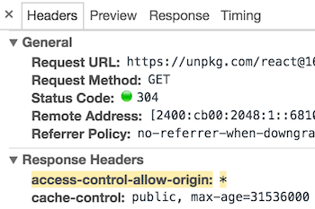

可以通过 CDN 获得 React 和 ReactDOM 的 UMD 版本。

```html
<script crossorigin src="https://unpkg.com/react@16/umd/react.development.js"></script>
<script crossorigin src="https://unpkg.com/react-dom@16/umd/react-dom.development.js"></script>
```

上述版本仅用于开发环境，不适合用于生产环境。React 的压缩和优化之后的生产环境版本链接如下：

```html
<script crossorigin src="https://unpkg.com/react@16/umd/react.production.min.js"></script>
<script crossorigin src="https://unpkg.com/react-dom@16/umd/react-dom.production.min.js"></script>
```

如果需要加载指定版本的 `react` 和 `react-dom`，可以把 `16` 替换成需要加载的版本号。

### 为什么要使用 `crossorigin` 属性?

如果你通过 CDN 的方式引入 React, 我们建议你设置 [`crossorigin`](https://developer.mozilla.org/en-US/docs/Web/HTML/CORS_settings_attributes) 属性：

```html
<script crossorigin src="..."></script>
```

我们同时建议你设置 `Access-Control-Allow-Origin: *` HTTP请求头来验证 CDN：



这样可以在 React 的16及以上的版本中有更好的 [错误处理体验](/blog/2017/07/26/error-handling-in-react-16.html)。
