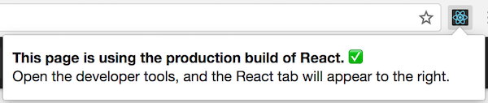
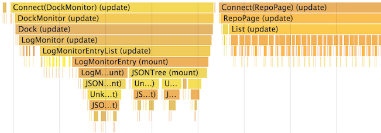

更新UI时，React在内部使用几种巧妙的技术来最小化DOM操作的数量。对许多应用来说，使用React不需要做太多的优化工作就可以快速创建用户界面。除此之外，还有一些优化React应用性能的办法。

## 使用生产版本

在React应用中检测性能问题时，请务必使用压缩过的生产版本。

默认情况下，React包含很多在开发过程中很有帮助的警告。然而，这会导致React更大更慢。因此，在部署应用时，请确认使用了生产版本。

如果你不确定构建过程是否正确，可以安装[React开发者工具（chrome）](https://chrome.google.com/webstore/detail/react-developer-tools/fmkadmapgofadopljbjfkapdkoienihi)。当你访问一个生产模式的React页面时，这个工具的图标会有一个黑色的背景：



当你访问一个开发模式的React页面时，这个工具的图标会有一个红色的背景：


最好在开发应用时使用开发模式，部署应用时换为生产模式。

以下是构建生产应用的流程。

### Create React App方式

如果你的项目是以[Create React App](https://github.com/facebookincubator/create-react-app)创建的，运行如下代码：

```
npm run build
```

这将会在该项目的`build/`文件夹内创建一个生产版本的应用。

注意只有发布项目时才有必要这样做，正常开发时，使用`npm start`。

### 单文件生产版本

我们提供压缩好的生产版本的React和React DOM文件:

```html
<script src="https://unpkg.com/react@15/dist/react.min.js"></script>
<script src="https://unpkg.com/react-dom@15/dist/react-dom.min.js"></script>
```

注意只有结尾为`.min.js`的React文件才是适合生产使用的。

### Brunch

为了创建最高效的Brunch生产版本，需要安装[`uglify-js-brunch`](https://github.com/brunch/uglify-js-brunch) 插件:

```
# If you use npm
npm install --save-dev uglify-js-brunch

# If you use Yarn
yarn add --dev uglify-js-brunch
```

接下来，为了构建生产版本，在`build`命令后添加`-p`参数：

```
brunch build -p
```

注意只有生产版本需要这样操作。不要在开发环境中安装这个插件或者使用`-p`参数，因为它会隐藏掉有用的React警告并使构建过程更慢。

### Browserify

为了创建最高效的Browserify生产版本，需要安装一些插件：

```
# If you use npm
npm install --save-dev bundle-collapser envify uglify-js uglifyify 

# If you use Yarn
yarn add --dev bundle-collapser envify uglify-js uglifyify 
```

为了构建生产版本，务必添加这些设置指令 **(参数很重要)**:

* [`envify`](https://github.com/hughsk/envify)该插件确保正确的编译环境，全局安装（`-g`）。
* [`uglifyify`](https://github.com/hughsk/uglifyify)该插件移除了开发接口。全局安装（`-g`）。
* [`bundle-collapser`](https://github.com/substack/bundle-collapser)该插件用数字替代了长长的模块ID。
* 最后，以上结果都被输添加至[`uglify-js`](https://github.com/mishoo/UglifyJS2)来得到整合。([了解原因](https://github.com/hughsk/uglifyify#motivationusage)).

举个例子：

```
browserify ./index.js \
  -g [ envify --NODE_ENV production ] \
  -g uglifyify \
  -p bundle-collapser/plugin \
  | uglifyjs --compress --mangle > ./bundle.js
```

>**注意：**
>
>包的名称是`uglify-js`，但是它提供的文件叫`uglifyjs`。<br>
>这不是一个错字。

注意只有生产版本需要这样操作。不要在开发环境中安装这些插件，因为它们会隐藏掉有用的React警告并使构建过程更慢。

### Rollup

为了创建最高效的Rollup生产版本，需要安装一些插件：

```
# If you use npm
npm install --save-dev rollup-plugin-commonjs rollup-plugin-replace rollup-plugin-uglify 

# If you use Yarn
yarn add --dev rollup-plugin-commonjs rollup-plugin-replace rollup-plugin-uglify 
```

为了构建生产版本，务必添加这些插件 **(参数很重要)**:

* [`replace`](https://github.com/rollup/rollup-plugin-replace)该插件确保正确的编译环境。
* [`commonjs`](https://github.com/rollup/rollup-plugin-commonjs)该插件在Rollup内提供对CommonJS的支持。
* [`uglify`](https://github.com/TrySound/rollup-plugin-uglify)该插件压缩生成最终版本。

```js
plugins: [
  // ...
  require('rollup-plugin-replace')({
    'process.env.NODE_ENV': JSON.stringify('production')
  }),
  require('rollup-plugin-commonjs')(),
  require('rollup-plugin-uglify')(),
  // ...
]
```

查看完整的[安装例子](https://gist.github.com/Rich-Harris/cb14f4bc0670c47d00d191565be36bf0).

注意只有生产版本需要这样操作。不要在开发环境中安装`uglify`和`replace`，因为它们会隐藏掉有用的React警告并使构建过程更慢。

### Webpack

>**注意：**
>
>如果你正在使用[Create React App](#create-react-app)方式，参考上述文档。<br>
>本节只适用于直接配置Webpack的情况。

为了创建最高效的Webpack生产版本，需要在生产版本的配置中添加这些插件：

```js
new webpack.DefinePlugin({
  'process.env': {
    NODE_ENV: JSON.stringify('production')
  }
}),
new webpack.optimize.UglifyJsPlugin()
```

了解更多参见[Webpack文档](https://webpack.js.org/guides/production-build/).

注意只有生产版本需要这样操作。不要在开发环境中安装`UglifyJsPlugin`和`DefinePlugin`，因为它们会隐藏掉有用的React警告并使构建过程更慢。

## 使用 Chrome Performance 归档组件

在**开发**模式下， 在支持的浏览器内使用性能工具可以直观的了解组件何时挂载，更新和卸载。例如：

<center></center>

Chrome浏览器内：

1. 在项目地址栏内添加查询字符串 `?react_perf`（例如， `http://localhost:3000/?react_perf`）。

2. 打开Chrome开发工具**[Performance](https://developers.google.com/web/tools/chrome-devtools/evaluate-performance/timeline-tool)** 标签页点击**Record**.

3. 执行你想要分析的动作。不要记录超过20s，不然Chrome可能会挂起。

4. 停止记录。

5. React事件将会被归类在 **User Timing**标签下。

更多的详细操作，请参考 [BenSchwarz 的这篇文章](https://building.calibreapp.com/debugging-react-performance-with-react-16-and-chrome-devtools-c90698a522ad)。

注意**由于这些数字是相对的，因此组件在生产版本中会运行更快**。然而，这也能够帮助你了解何时会有无关的组件被错误的更新，以及你的组件更新的深度和频率。

目前浏览器中仅有Chrome，Edge和IE支持此特性，但是我们使用此标准[用户Timing API](https://developer.mozilla.org/en-US/docs/Web/API/User_Timing_API)，因此我们期待更多的浏览器对其添加支持。

## 虚拟化长列表

If your application renders long lists of data (hundreds or thousands of rows), we recommended using a technique known as “windowing”. This technique only renders a small subset of your rows at any given time, and can dramatically reduce the time it takes to re-render the components as well as the number of DOM nodes created.

[react-window](https://react-window.now.sh/) and [react-virtualized](https://bvaughn.github.io/react-virtualized/) are popular windowing libraries. They provide several reusable components for displaying lists, grids, and tabular data. You can also create your own windowing component, like [Twitter did](https://medium.com/@paularmstrong/twitter-lite-and-high-performance-react-progressive-web-apps-at-scale-d28a00e780a3), if you want something more tailored to your application’s specific use case.

## 避免协调

React在渲染出的UI内部建立和维护了一个内层的实现方式，它包括了从组件返回的React元素。这种实现方式使得React避免了一些不必要的创建和关联DOM节点，因为这样做可能比直接操作JavaScript对象更慢一些。有时它被称之为“虚拟DOM”，但是它其实和React Native的工作方式是一样的。

当一个组件的`props`或者`state`改变时，React通过比较新返回的元素和之前渲染的元素来决定是否有必要更新实际的DOM。当他们不相等时，React会更新DOM。

You can now visualize these re-renders of the virtual DOM with React DevTools:

- [Chrome Browser Extension](https://chrome.google.com/webstore/detail/react-developer-tools/fmkadmapgofadopljbjfkapdkoienihi?hl=en)
- [Firefox Browser Extension](https://addons.mozilla.org/en-GB/firefox/addon/react-devtools/)
- [Standalone Node Package](https://www.npmjs.com/package/react-devtools)

In the developer console select the **Highlight Updates** option in the **React** tab:

[](https://reactjs.org/static/devtools-highlight-updates-97eda4825de476af4515435a0c36ca78-a62e3.png)

Interact with your page and you should see colored borders momentarily appear around any components that have re-rendered. This lets you spot re-renders that were not necessary. You can learn more about this React DevTools feature from this [blog post](https://blog.logrocket.com/make-react-fast-again-part-3-highlighting-component-updates-6119e45e6833) from [Ben Edelstein](https://blog.logrocket.com/@edelstein).

Consider this example:


Note that when we’re entering a second todo, the first todo also flashes on the screen on every keystroke. This means it is being re-rendered by React together with the input. This is sometimes called a “wasted” render. We know it is unnecessary because the first todo content has not changed, but React doesn’t know this.

Even though React only updates the changed DOM nodes, re-rendering still takes some time. In many cases it’s not a problem, but if the slowdown is noticeable, you can speed all of this up by overriding the lifecycle function `shouldComponentUpdate`, which is triggered before the re-rendering process starts. The default implementation of this function returns `true`, leaving React to perform the update:

在一些情况下，你的组件可以通过重写这个生命周期函数`shouldComponentUpdate`来提升速度， 它是在重新渲染过程开始前触发的。 这个函数默认返回`true`，可使React执行更新：

```js
shouldComponentUpdate(nextProps, nextState) {
  return true;
}
```

如果你知道在某些情况下你的组件不需要更新，你可以在`shouldComponentUpdate`内返回`false`来跳过整个渲染进程，该进程包括了对该组件和之后的内容调用`render()`指令。

In most cases, instead of writing `shouldComponentUpdate()` by hand, you can inherit from [`React.PureComponent`](https://reactjs.org/docs/react-api.html#reactpurecomponent). It is equivalent to implementing `shouldComponentUpdate()` with a shallow comparison of current and previous props and state.

## shouldComponentUpdate实战

这是一个组件的子树。对其中每个组件来说，`SCU`表明了`shouldComponentUpdate`的返回内容，`vDOMEq`表明了待渲染的React元素与原始元素是否相等，最后，圆圈的颜色表明这个组件是否需要重新渲染。

<figure></figure>

由于以C2为根的子树的`shouldComponentUpdate`返回了`false`，React不会试图渲染C2，甚至不会在C4和C5上调用`shouldComponentUpdate`。

对C1和C3来说，`shouldComponentUpdate`返回了`true`，因此React会深入到分支中并检查它们。C6的`shouldComponentUpdate`返回了`true`，由于待渲染的元素与原始元素并不相等，React会更新这个DOM节点。

最后一个有趣的情况是C8，React需要渲染这个组件，但是由于组件元素返回值与原元素相等，因此它并没有更新这个DOM节点。

注意React只需更新C6，因为它是不可避免的。对C8来说，它通过比较待渲染元素与原始元素避免了渲染，对C2的子树和C7，它们甚至都没有执行比较，因为我们设置了`shouldComponentUpdate`为`false`，`render`没有被调用。

## 案例

如果想让组件只在`props.color`或者`state.count`的值变化时重新渲染，你可以像下面这样设定`shouldComponentUpdate`：

```js
class CounterButton extends React.Component {
  constructor(props) {
    super(props);
    this.state = {count: 1};
  }

  shouldComponentUpdate(nextProps, nextState) {
    if (this.props.color !== nextProps.color) {
      return true;
    }
    if (this.state.count !== nextState.count) {
      return true;
    }
    return false;
  }

  render() {
    return (
      <button
        color={this.props.color}
        onClick={() => this.setState(state => ({count: state.count + 1}))}>
        Count: {this.state.count}
      </button>
    );
  }
}
```

在以上代码中，`shouldComponentUpdate`只检查`props.color`和`state.count`的变化。如果这些值没有变化，组件就不会更新。当你的组件变得更加复杂时，你可以使用类似的模式来做一个“浅比较”，用来比较属性和值以判定是否需要更新组件。这种模式十分常见，因此React提供了一个辅助对象来实现这个逻辑 - 继承自`React.PureComponent`。以下代码可以更简单的实现相同的操作：

```js
class CounterButton extends React.PureComponent {
  constructor(props) {
    super(props);
    this.state = {count: 1};
  }

  render() {
    return (
      <button
        color={this.props.color}
        onClick={() => this.setState(state => ({count: state.count + 1}))}>
        Count: {this.state.count}
      </button>
    );
  }
}
```

大部分时候，你可以使用`React.PureComponent`而不必写你自己的`shouldComponentUpdate`，它只做一个浅比较。如果属性或状态可以以浅比较会错失的方式变化，此时你不能使用它。

对于更复杂的数据结构这可能成为一个问题。例如，假设你想要一个`ListOfWords`组件来渲染一个逗号分隔的单词列表，并使用一个带了点击按钮名字叫`WordAdder`的父组件来给子列表添加一个单词。以下代码*并不正确*： 

```js
class ListOfWords extends React.PureComponent {
  render() {
    return <div>{this.props.words.join(',')}</div>;
  }
}

class WordAdder extends React.Component {
  constructor(props) {
    super(props);
    this.state = {
      words: ['marklar']
    };
    this.handleClick = this.handleClick.bind(this);
  }

  handleClick() {
    // This section is bad style and causes a bug
    const words = this.state.words;
    words.push('marklar');
    this.setState({words: words});
  }

  render() {
    return (
      <div>
        <button onClick={this.handleClick} />
        <ListOfWords words={this.state.words} />
      </div>
    );
  }
}
```

问题是`PureComponent`将会在`this.props.words`的新旧值之间做一个简单的比较。由于代码中`words`数组在`WordAdder`的`handleClick`方法中被改变了，尽管数组中的实际单词已经改变，`this.props.words`的新旧值还是相等的，因此即便`ListOfWords`具有应该被渲染的新单词，它还是不会更新。

## 不会突变的数据的力量

避免此类问题最简单的方式是避免使用值可能会**突变**的属性或状态。例如，上面例子中的`handleClick`应该用`concat`重写成：

```js
handleClick() {
  this.setState(prevState => ({
    words: prevState.words.concat(['marklar'])
  }));
}
```

ES6支持数组的[展开语法](https://developer.mozilla.org/en-US/docs/Web/JavaScript/Reference/Operators/Spread_operator)可以让它变得更容易。如果你使用的是`Create React App`，那么此语法默认可用。

```js
handleClick() {
  this.setState(prevState => ({
    words: [...prevState.words, 'marklar'],
  }));
};
```

你也可以用相似的方式重写可以会突变的对象。例如，假设我们有一个叫`colormap`的对象，我们想写一个把`colormap.right`改变成`'blue'`的函数，我们应该写：

```js
function updateColorMap(colormap) {
  colormap.right = 'blue';
}
```

想要实现代码而不突变原始对象，我们可以使用[Object.assign](https://developer.mozilla.org/en-US/docs/Web/JavaScript/Reference/Global_Objects/Object/assign)方法：

```js
function updateColorMap(colormap) {
  return Object.assign({}, colormap, {right: 'blue'});
}
```

`updateColorMap`现在会返回一个新对象，而不会突变之前的旧对象。`Object.assign`在ES6中，需要`polyfill`支持。

有一个JavaScript提议来添加[对象展开属性](https://github.com/sebmarkbage/ecmascript-rest-spread)以使其更容易地更新对象并且不会突变对象：

```js
function updateColorMap(colormap) {
  return {...colormap, right: 'blue'};
}
```

如果使用`Create React App`，默认情况下 `Object.assign`和对象展开语法都可以使用。

## 使用不可突变的数据结构

[Immutable.js](https://github.com/facebook/immutable-js)是解决这个问题的另一种方法。它通过结构共享提供不可突变的，持久的集合：

* *不可突变*:一旦创建，集合就不能在另一个时间点改变。
* *持久性*:可以使用原始集合和一个突变来创建新的集合。原始集合在新集合创建后仍然可用。
* *结构共享*:新集合尽可能多的使用原始集合的结构来创建，以便将复制操作降至最少从而提升性能。

不可突变性使得跟踪改变很方便。每个变化都会导致产生一个新的对象，因此我们只需检查对象的引用是否有改变。例如，在这个常规的JavaScript代码中：

```js
const x = { foo: 'bar' };
const y = x;
y.foo = 'baz';
x === y; // true
```

虽然`y`被编辑了，但是由于它与`x`索引了相同的对象，这个比较会返回`true`。你可以使用`immutable.js`实现类似效果：

```javascript
const SomeRecord = Immutable.Record({ foo: null });
const x = new SomeRecord({ foo: 'bar' });
const y = x.set('foo', 'baz');
x === y; // false
```

在这个例子中，`x`突变后返回了一个新的引用，因此我们可以安全的确认`x`被改变了。

还有两个库可以帮助我们使用不可突变数据：[seamless-immutable](https://github.com/rtfeldman/seamless-immutable) 和[immutability-helper](https://github.com/kolodny/immutability-helper)。

不可突变的数据结构帮助我们轻松地在对象上追踪变化，我们只需要实现`shouldComponentUpdate`。这通常可以提供一个不错的性能提升。
