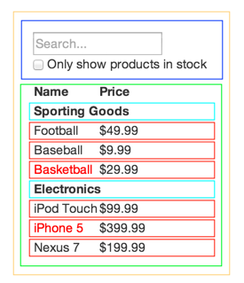

在我们的理念中，React 最初的目的是使用 JavaScript 创建大型的，快速响应的网络应用。它在我们的 Facebook 和 Instagram 中已经实践的非常好了。

React的众多优点之一是它让你在编写代码的时候同时也在思考你的应用。在这篇文档中，我们会带你使用 React 一起创建一个可搜索的产品数据表格，并向你展示我们的思考过程。

## 从模拟页面开始

想象我们已经有一个 JSON 接口和一个设计师给我们的原型图。原型图像下面这样：


我们的 JSON 接口返回类似下面的数据：

```
[
  {category: "Sporting Goods", price: "$49.99", stocked: true, name: "Football"},
  {category: "Sporting Goods", price: "$9.99", stocked: true, name: "Baseball"},
  {category: "Sporting Goods", price: "$29.99", stocked: false, name: "Basketball"},
  {category: "Electronics", price: "$99.99", stocked: true, name: "iPod Touch"},
  {category: "Electronics", price: "$399.99", stocked: false, name: "iPhone 5"},
  {category: "Electronics", price: "$199.99", stocked: true, name: "Nexus 7"}
];
```

## 第一步：把 UI 划分出组件层级

第一件你要做的事情是用方框划分出每一个组件(和子组件)并给他们命名。如果你和设计师一起工作，他们可能已经完成了这些，所以去和他们聊聊吧！他们的 Photoshop 图层名称也许就是你的 React 组件名称！

但你如何知道哪一部分应该成为一个组件？想想在编写代码时你在什么情况下需要新建一个函数或对象，思考方式是一样的。例如 [单一功能原则](https://en.wikipedia.org/wiki/Single_responsibility_principle)，在理想状况下，一个组件应该只做一件事情。如果这个组件功能不断丰富，它应该被分成更小的组件。

既然你经常向用户展示 JSON 数据模型，你会发现，如果你的模型构建正确，你的 UI (以及你的组件结构)会被很好的映射。这是因为 UI 和数据模型往往遵循着相同的*信息架构*，这意味着将 UI 划分成组件的工作往往是很容易的。只要把它划分成能准确表示你数据模型的一部分的组件就可以。



在这里你会看到，我们的简单应用中有5个组件。我们把每个组件展示的数据用斜体表示。

  1. **`FilterableProductTable` (橙色):** 包含了整个例子
  2. **`SearchBar` (蓝色):** 接受所有的*用户输入*
  3. **`ProductTable` (绿色):** 根据*用户输入*过滤并展示*数据集合*
  4. **`ProductCategoryRow` (绿松石色):** 展示每个*分类*的标题
  5. **`ProductRow` (红色):** 用行来展示每个*产品*

如果你查看 `ProductTable`，你会发现表头(包含 `Name` 和 `Price` 标签)并没有作为一个组件。这是一个偏好问题，选择哪种方式目前还存在争议。在这个例子中，我们把它作为 `ProductTable` 的一部分，因为它是渲染*数据集合*的一部分，而渲染*数据集合*是 `ProductTable` 的职责。然而，如果头部变得更加复杂(也就是，如果我们添加了排序功能)，它就有足够的理由成为一个单独的 `ProductTableHeader` 组件。

现在我们已经确定了原型图中的组件，让我们把它们整理成层级结构。这很容易。原型图中的子组件在层级结构中应该作为子节点。

  * `FilterableProductTable`
    * `SearchBar`
    * `ProductTable`
      * `ProductCategoryRow`
      * `ProductRow`

## 第二步：用 React 创建一个静态版本

<p data-height="600" data-theme-id="0" data-slug-hash="vXpAgj" data-default-tab="js" data-user="lacker" data-embed-version="2" class="codepen">See the Pen <a href="http://codepen.io/lacker/pen/vXpAgj/">Thinking In React: Step 2</a> on <a href="http://codepen.io">CodePen</a>.</p>
<script async src="//assets.codepen.io/assets/embed/ei.js"></script>

现在有了组件层级，是时候去实现你的应用了。最简单的方式是先创建一个静态版本：传入数据模型，渲染 UI 但没有任何交互。最好把这些过程解耦，因为创建一个静态版本更多需要的是码代码，不太需要逻辑思考，而添加交互则更多需要的是逻辑思考，不是码代码。我们会看看为什么是这样的。

要构建一个用于呈现数据模型的静态版本的应用程序，你需要创建能够复用其他组件的组件，并通过 *props* 来传递数据。*props* 是一种从父级向子级传递数据的方法。如果你熟悉 *state* 的概念， 在创建静态版本的时候*不要使用 state*。State 只在交互的时候使用，即随时间变化的数据。由于这是静态版本的应用，你不需要使用它。

你可以自顶向下或者自底向上构建应用。也就是，你可以从层级最高的组件开始构建(即 `FilterableProductTable`开始)或层级最低的组件开始构建(`ProductRow`)。在较为简单的例子中，通常自顶向下更容易，而在较大的项目中，自底向上会更容易并且在你构建的时候有利于编写测试。

在这步的最后，你会拥有一个用于呈现数据模型的可重用组件库。这些组件只会有 `render()` 方法，因为这只是你的应用的静态版本。层级最高的组件(`FilterableProductTable`)会把数据模型作为 prop 传入。如果你改变你的基础数据模型并且再次调用 `ReactDOM.render()`， UI 会更新。很容易看到你的 UI 是如何更新的，哪里进行了更新。因为没有什么复杂的事情发生。React 的**单向数据流**(也叫作*单向绑定*)保证了一切是模块化并且是快速的。

如果你在这步需要帮助，请参阅 [React 文档](/docs/)

### 一个小插曲：Props VS State

在 React 中有两种数据模型：props 和 state。理解两者的差别是很重要的；如果你还不确定差别是什么，请查看[React 官方文档](/docs/state-and-lifecycle.html)

## 第三步：定义 UI 状态的最小(但完整)表示

为了使你的 UI 交互，你需要能够触发对底层数据模型的更改。React 使用 **state**，让这变的更容易。

为了正确构建你的应用，首先你需要考虑你的应用所需要的最小可变状态集。要点是 DRY：*不要重复(Don't Repeat Yourself)*。找出应用程序的绝对最小表示并计算你所需要的其他任何请求。例如，如果你正在创建一个 TODO 列表，只要保存一个包含 TODO 事项的数组；不要为计数保留一个单独的状态变量。相反，当你想要渲染 TODO 计数时，只需要使用 TODO 数组的长度就可以了。

想想我们的实例应用中所有数据。我们有：

  * 原产品列表
  * 用户输入的搜索文本
  * 复选框的值
  * 产品的筛选列表

让我们来看看每一条，找出哪一个是 state。每个数据只要考虑三个问题：

  1. 它是通过 props 从父级传来的吗？如果是，他可能不是 state。
  2. 它随着时间推移不变吗？如果是，它可能不是 state。
  3. 你能够根据组件中任何其他的 state 或 props 把它计算出来吗？如果是，它不是 state。

原产品列表被作为 props 传入，所以它不是 state。搜索文本和复选框似乎是 state，因为它们随时间改变并且不能由其他任何值计算出来。最后，产品的筛选列表不是 state，因为它可以通过将原始产品列表与搜索文本和复选框的值组合计算出来。

最后，我们的 state 有：

  * 用户输入的搜索文本
  * 复选框的值

## 第四步：确定你的 State 应该位于哪里

<p data-height="600" data-theme-id="0" data-slug-hash="ORzEkG" data-default-tab="js" data-user="lacker" data-embed-version="2" class="codepen">See the Pen <a href="http://codepen.io/lacker/pen/ORzEkG/">Thinking In React: Step 4</a> by Kevin Lacker (<a href="http://codepen.io/lacker">@lacker</a>) on <a href="http://codepen.io">CodePen</a>.</p>
<script async src="//assets.codepen.io/assets/embed/ei.js"></script>

好的，现在我们确定了应用 state 的最小集合。接下来，我们需要确定哪个组件会改变，或拥有这个 state。

记住：React 中的数据流是单向的，并在组件层次结构中向下传递。一开始我们可能不是很清楚哪个组件应该拥有哪个 state。**在新手理解上这通常是最富有挑战性的部分**，所以按照下面的步骤来辨别：

对你应用的每一个 state：

  * 确定每一个需要这个 state 来渲染的组件。
  * 找到一个公共所有者组件(一个在层级上高于所有其他需要这个 state 的组件的组件)
  * 这个公共所有者组件或另一个层级更高的组件应该拥有这个 state。
  * 如果你没有找到可以拥有这个 state 的组件，创建一个仅用来保存状态的组件并把它加入比这个公共所有者组件层级更高的地方。

让我们用这个策略分析我们的应用：

  * `ProductTable` 需要根据 state 过滤产品列表，`SearchBar` 需要展示搜索文本和复选框状态。
  * 公共所有者组件是 `FilterableProductTable`。
  * 筛选文本和复选框的值应该放在 `FilterableProductTable`。

很酷，所以我们决定把 state 放在 `FilterableProductTable`。首先，为 `FilterableProductTable` 的 `constructor` 添加一个实例属性 `this.state = {filterText: '', inStockOnly: false}` 来表示我们应用的初始状态。接下来，把 `filterText` 和 `inStockOnly` 作为 prop 传入 `ProductTable` 和 `SearchBar`。最后在 `ProductTable` 中使用这些 props 来筛选每行产品信息，在 `SearchBar` 中设置表单域的值。

现在你能够看到你的应用是如何运作的了：设置 `filterText` 的值为 `ball` 并刷新你的应用。你会看到数据表格正确的更新了。

## 第五步：添加反向数据流

<p data-height="265" data-theme-id="0" data-slug-hash="qRqmjd" data-default-tab="js,result" data-user="rohan10" data-embed-version="2" data-pen-title="Thinking In React: Step 5" class="codepen">See the Pen <a href="http://codepen.io/rohan10/pen/qRqmjd">Thinking In React: Step 5</a> on <a href="http://codepen.io">CodePen</a>.</p>
<script async src="https://production-assets.codepen.io/assets/embed/ei.js"></script>

到目前为止，我们已经创建了一个可以正确渲染的应用程序，它的数据在层级中通过函数的 props 和 state 向下流动。现在是时候支持其他方式的数据流了：层级结构中最底层的表单组件需要去更新在 `FilterableProductTable` 中的 state。

React 的数据流很明显，让你可以很轻松的了解你的程序是如何运行的，但相较于传统的双向绑定，它的代码量会稍微多一点。

在当前版本的示例中，如果你试图键入或选中复选框，你会发现 React 会忽略你的输入。这是故意的，因为我们把 `input` 的 `value` 属性设置为一直等于从 `FilterableProductTable` 传入的 `state`.

让我们想想我们想要做什么。我们想确保每当用户更改表单时，我们更新状态来反应用户输入。因为组件应该只更新自己的状态， `FilterableProductTable` 会将一个回调函数传递给 `SearchBar` ，每当应该更新状态时，它就会触发。我们可以使用输入上的 `onChange` 事件来调用它。`FilterableProductTable` 传入的回调函数会调用 `setState()`，这时应用程序会被更新。

虽然这听起来很复杂，但它只是几行代码的问题。而且，你可以清楚地看出你的应用中数据是如何流动的。

## 就是这样

希望这可以让你了解如何使用 React 构建组件和应用程序。虽然这可能会比以前编写更多的代码，但请记住，代码是用来读的，这比写更重要，并且非常容易阅读这个模块化的，思路清晰的代码。当你开始构建大型组件库的时候，你会开始欣赏 React 的思路清晰化和模块性，并且随着代码的复用，你的代码量会开始减少。:)